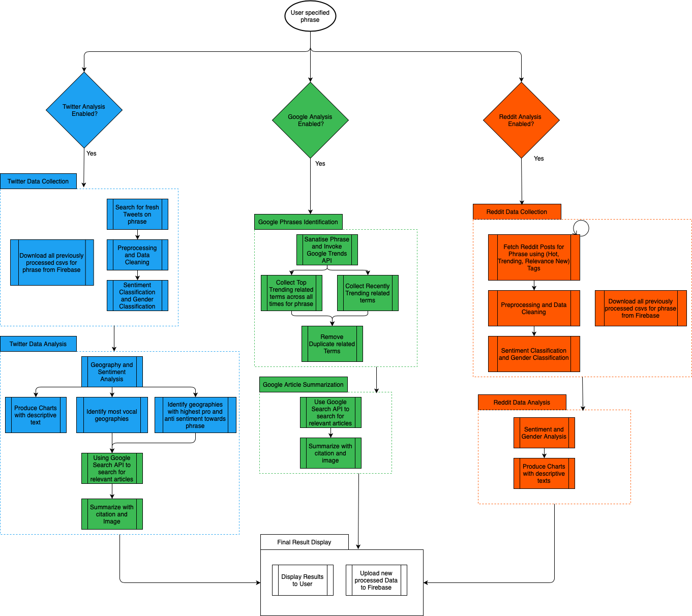

# Do My Research

*'Do my Research'* is a implementation of using Deep Learning techniques to automatically create a detailed report which performs qualitative and quantitative analysis on any specified term or phrase.

## Build
The project leverages various Python and NodeJS depedencies. 

    pip install -r requirements.txt
    (sudo) npm install
   
A bash script is provided to automatically set up the environment, in addition to
downloading the large files unable to be kept on GitHub.

    bash ./build.sh
   
## Running Do My Research
Open two terminal instances from the root of this project and run:

    yarn start

And the following in another terminal instance:

    yarn start-api

  

## Work Flow
The work flow of the application can be explained via the following workflow diagram:

Sample Files Can be found at: (Do My Research Files)[https://drive.google.com/drive/folders/10nEaukzvPvrtr6EXu6_dMiiHzzx47IE-?usp=sharing]
